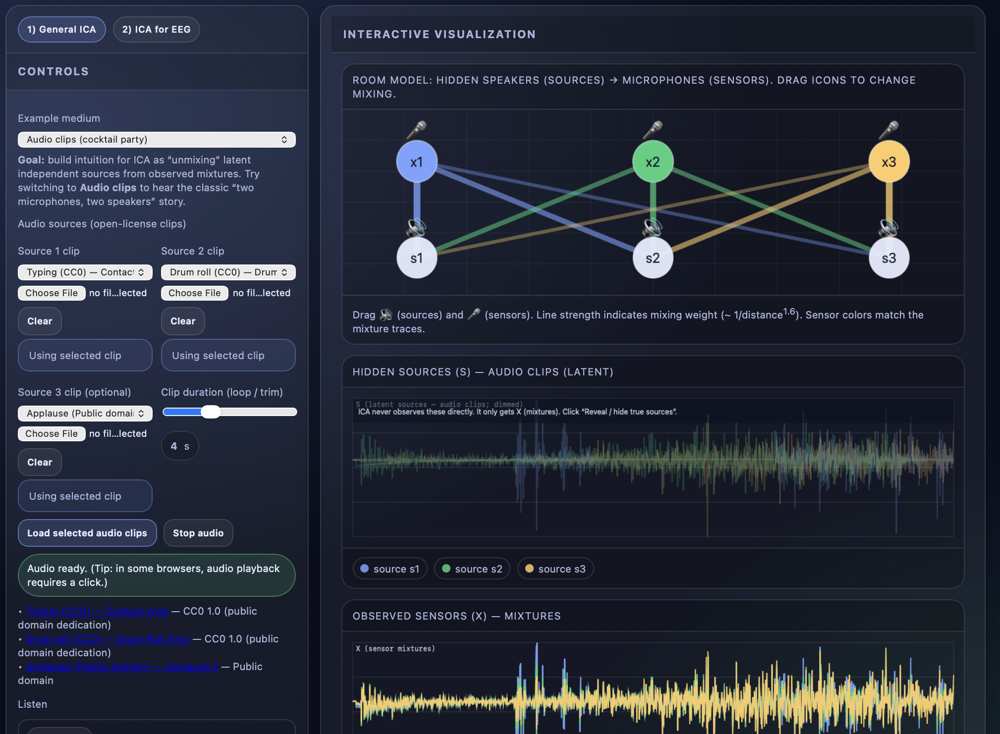

# ICA Applied to EEG Data — Interactive Demo

<!--  -->

A self-contained, interactive, browser-based demo designed to help undergrad/grad students build intuition for **Independent Component Analysis (ICA)** in general and how ICA is used for **EEG artifact separation/cleanup**.

This project is **zero-dependency** and implemented as a **single HTML file** (HTML/CSS/vanilla JS). The demo is intended for conceptual understanding and classroom use—not production ICA analysis.

## Run Demo at
**GitHub Pages:** `https://dbrang.github.io/EEG-ICA-Demo/`

---

## Purpose

ICA is often introduced with matrix equations, but students usually need an *intuitive mental model* before the math “clicks.” This demo provides two connected perspectives:

1. **General ICA (Signals / Cocktail Party)**  
   Hidden sources (independent causes) are mixed into sensor observations. ICA attempts to recover components that are as statistically independent as possible.

2. **ICA for EEG**  
   Each EEG channel is modeled as a weighted mixture of latent sources (brain rhythms + artifacts). ICA separates components with distinct **time courses** and **scalp weight patterns**, enabling artifact component removal and reconstruction of “cleaned” channels.

---

## ✨ Key Features

### 1) General ICA
- **Two mediums:** synthetic time-series signals or **audio clips (“cocktail party”)**
- **Interactive mixing:** drag “speakers” and “microphones” to change the mixing geometry
- **Auto-updating:** mixtures and ICA update immediately (no “run” button needed)
- **Reveal ground truth:** toggle true sources vs observed mixtures vs recovered components
- **Controls:** number of sources/sensors, additive sensor noise, mixing strength, source styles
- **Intuition builders:**
  - Displays the mixing matrix **A** and estimated unmixing **W**
  - “Channel contributions” views that connect weights to reconstructions:
    - how sensors combine to form a component (Ŝ = W·X)
    - how components combine to form a sensor (X = A·Ŝ)

### 2) ICA for EEG
- **Simulated EEG scenarios** (presets):
  - Blink artifact + alpha rhythm
  - Muscle burst + alpha/theta
  - Blink + muscle + line noise
- **One-click workflow:**
  - Generate EEG → Run ICA → click components → remove artifacts → reconstruct
- **Component inspection:** select a component to view its **time course** and **scalp weights/topography**
- **Teaching shortcut:** “Auto-remove blink-like comp” button for a quick artifact-removal demonstration
- **Noise + epoch length controls** to explore when ICA succeeds vs struggles

---

## Quick Start

No build step, no installation.

### Option A — Open locally
1. Download/clone the repo.
2. Open the HTML file in a modern browser (Chrome/Firefox/Safari/Edge).

### Option B — Serve locally (recommended for consistent audio loading)
Some browsers apply stricter rules to `file://` pages (especially around audio). Serving the file avoids those issues.

```bash
# from the repo directory
python -m http.server 8000
```

Then open: `http://localhost:8000/`

### Option C — GitHub Pages
1. Put the demo HTML in the repo root as `index.html`.
2. Enable Pages (Settings → Pages → Deploy from branch).
3. Use the URL shown by GitHub Pages.

---

## Controls Guide

### General ICA tab
- **Example medium:** Synthetic signals vs Audio clips (cocktail party)
- **Audio mode controls:**
  - choose open-license clips or upload your own audio for each source
  - set loop/trim duration
  - load/stop audio playback
- **Model controls:**
  - `# sources` (latent causes)
  - `# sensors` (observations)
  - additive sensor noise (σ)
  - mixing strength (scale)
  - source type presets (oscillations / sparse events / mixed)
- **Buttons:**
  - Reveal/hide true sources
  - Randomize room layout
  - Reset

### ICA for EEG tab
- **Scenario preset:** blink / muscle / mixed
- **Sensor noise:** σ
- **Epoch length:** seconds
- **Buttons:**
  - Generate EEG
  - Run ICA
  - Auto-remove blink-like comp
  - Reset
- **After ICA:**
  - click components to inspect
  - toggle/remove components to reconstruct cleaned EEG channels

---

## How It Works (Under the Hood)

### Core mixing model
The demo uses the standard linear ICA story:

- Observations (sensors): **X = A·S**
- ICA estimate: **Ŝ = W·X**, where **W** is chosen to make components **as independent as possible**

ICA uses higher-order (non-Gaussian) information—not just correlation.

### Implementation note
This page runs a small **FastICA-style** routine (tanh nonlinearity) entirely in-browser with lightweight linear algebra sized for small matrices.

---

## Teaching / Classroom Flow (suggested)

1. Start on **“General ICA”**
2. Drag speakers/microphones to change the mixing geometry
3. Listen to **sources vs mixtures vs ICA components**
4. Discuss core assumptions:
   - linear mixing
   - statistical independence
   - non-Gaussianity / higher-order structure
5. Switch to **“ICA for EEG”**
6. Generate EEG → run ICA → identify artifact-like components → remove → reconstruct cleaned channels

---

## Audio Credits (General ICA → Audio mode)

Audio mode can download CC0/Public Domain clips from Wikimedia Commons (internet required). The built-in clips include:

- **Drum roll (CC0)** — “Drum Roll Intro”  
  https://commons.wikimedia.org/wiki/File:Drum_Roll_Intro.ogg
- **Typing (CC0)** — “Contact type” (from pdsounds.org via Wikimedia)  
  https://commons.wikimedia.org/wiki/File:Contact_type.ogg
- **Applause (Public Domain)** — “Applause ii” (from pdsounds.org via Wikimedia)  
  https://commons.wikimedia.org/wiki/File:Applause_ii.ogg

(You can also upload local audio files per source.)

---

## Contributing

Contributions are welcome—especially improvements that strengthen pedagogy, clarify visualizations, or add additional EEG/ICA scenarios. Feel free to fork and open a PR.

---

## License

Recommended: **MIT License** (to match the other demos). Add a `LICENSE` file if you haven’t already.

---

## About

Developed for educational use in neuroscience, signal processing, and EEG methods courses.
